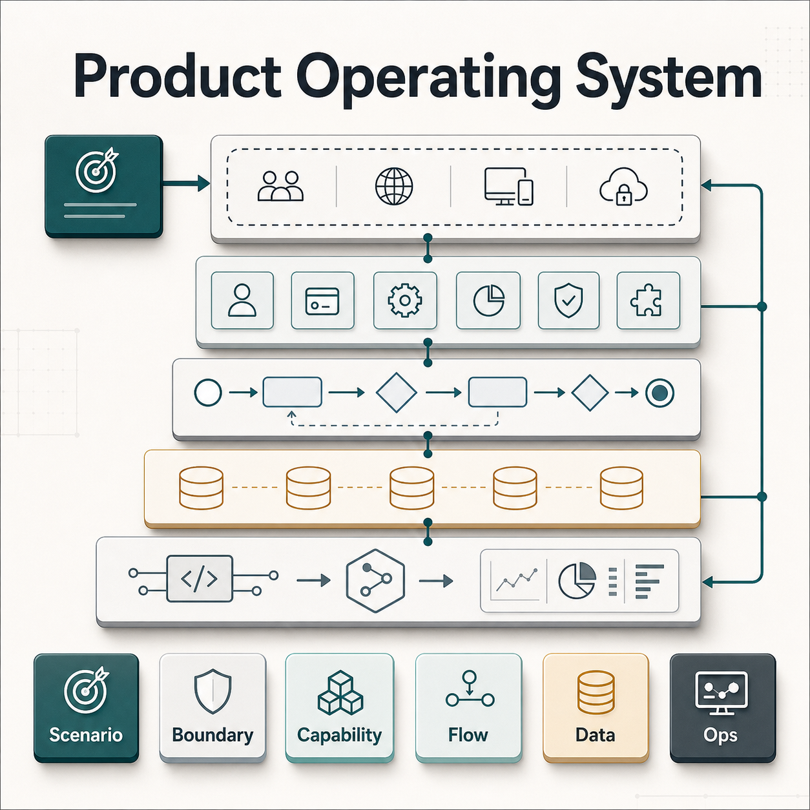
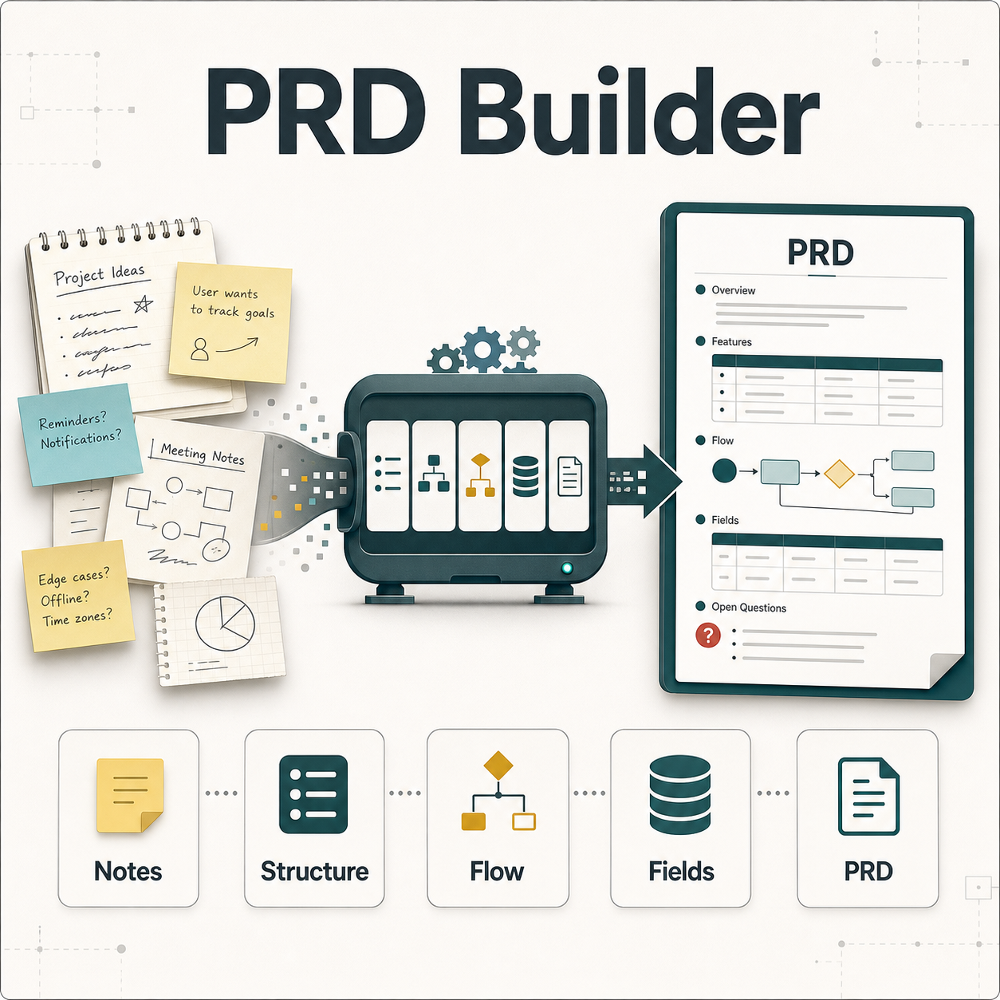
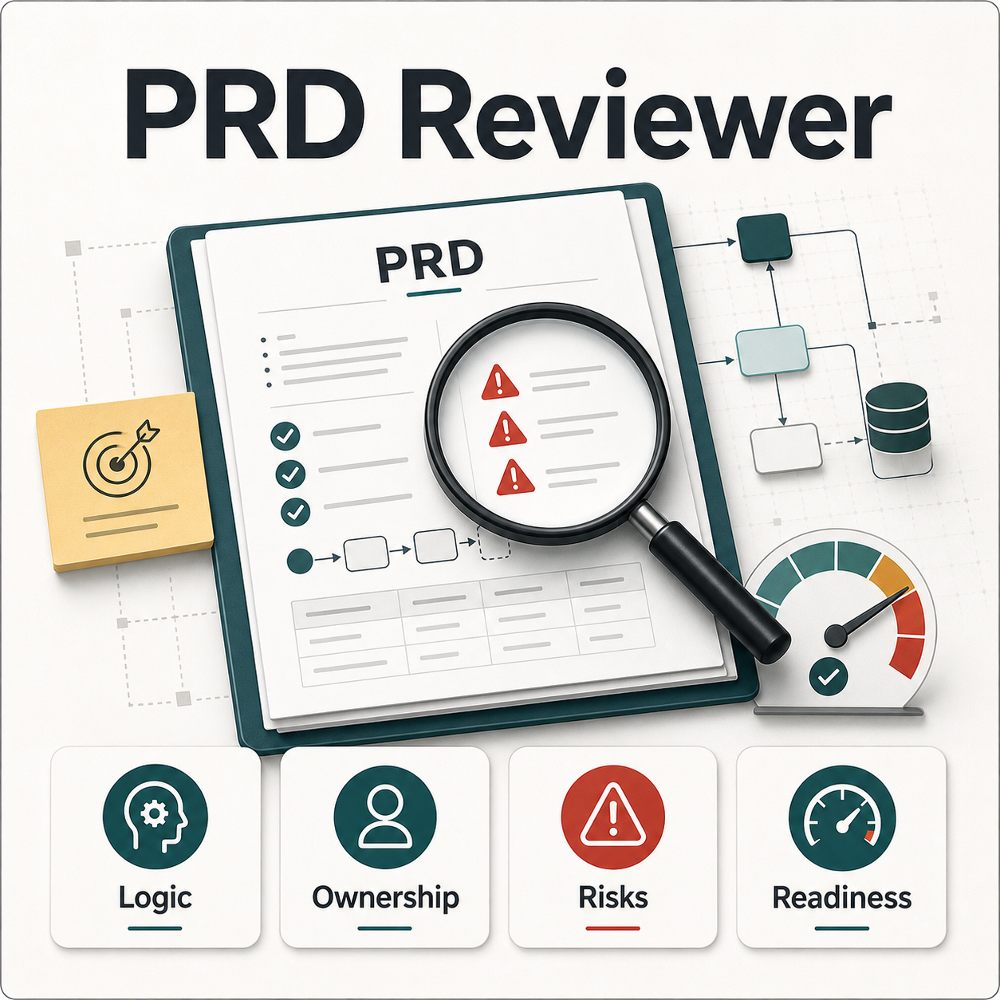
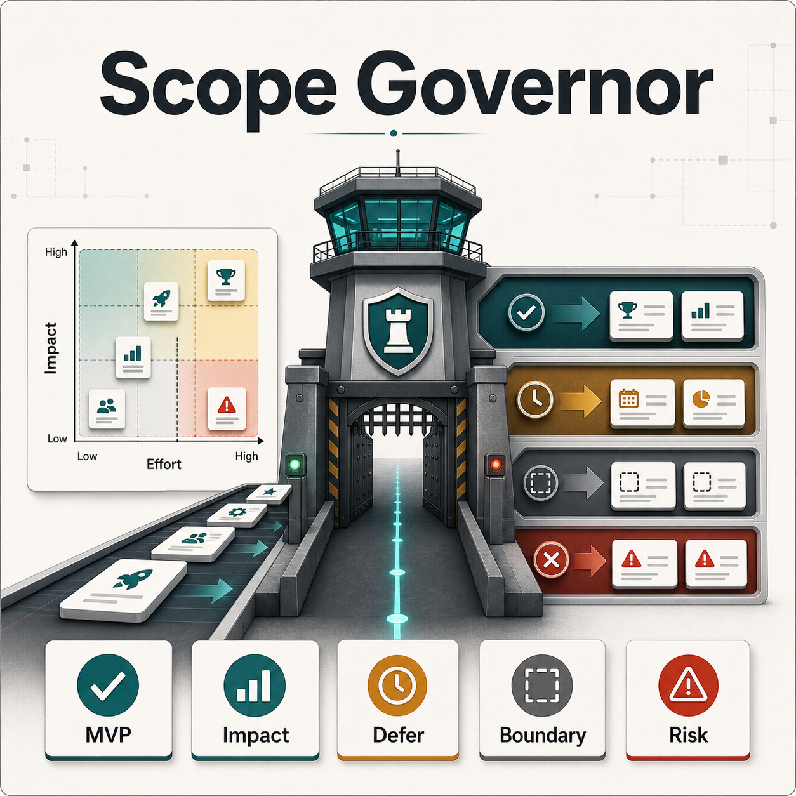

# Yindong Codex Skills

Codex skills for structured product collaboration.

This repository contains a small set of Codex skills for complex product work, including product requirements, platform capability design, PRD drafting and review, and MVP scope control.

They are designed for product scenarios involving cross-system collaboration, platform capabilities, product governance, and long-term knowledge reuse.

The goal is not to generate generic PM documentation. The goal is to help AI collaborate with a more stable product operating logic:

- abstract business problems into platform capabilities
- clarify system boundaries and ownership
- prefer reuse before new build
- model flows before writing prose
- cover states, data models, APIs, edge cases, and operational closure
- protect MVP boundaries
- actively challenge gaps during PRD review

## Visual Overview

<p>
  
  
</p>

<p>
  
  
</p>

## Skills

### `yindong-product-operating-system`

Core operating rules for complex product collaboration.

Use for:

- platform capability abstraction
- system-boundary reasoning
- reuse-first design
- flow-first thinking
- operational risk analysis
- MVP boundary control
- decision support
- challenge mode

### `yindong-prd-builder`

Build professional PRDs or requirement sections from rough Chinese/English notes, prototypes, meeting notes, or early ideas.

Use for:

- structured PRD drafting
- English PRD / BRD writing
- 0-to-1 platform requirement framing
- API / Data / Scenario / Ops section structuring
- product-readable requirement enrichment

### `yindong-prd-reviewer`

Review PRDs for product and system completeness.

Use for:

- logic closure review
- ownership review
- flow and state review
- data model review
- API readiness review
- operational gap review
- rollout risk review

### `yindong-scope-governor`

Assess MVP scope, phase boundaries, change impact, and hidden complexity.

Use for:

- MVP vs future iteration decisions
- impact analysis before drafting
- include / defer / placeholder recommendations
- workflow, permission, UI, API, operations, and migration impact checks

## Installation

Clone this repository:

```bash
git clone https://github.com/linyindong/Yindong-skills.git
cd Yindong-skills
```

Copy the desired skill folders into your local Codex skills directory:

```bash
mkdir -p ~/.codex/skills
cp -R skills/yindong-product-operating-system ~/.codex/skills/
cp -R skills/yindong-prd-builder ~/.codex/skills/
cp -R skills/yindong-prd-reviewer ~/.codex/skills/
cp -R skills/yindong-scope-governor ~/.codex/skills/
```

You can install all skills, or only copy the ones you want to use.

## How to Use

In Codex, explicitly mention the skill name with `$skill-name`.

Examples:

```text
Use $yindong-product-operating-system to reason through this platform requirement.
Use $yindong-prd-builder to turn these rough notes into a PRD section.
Use $yindong-prd-reviewer to check whether this PRD is logically complete.
Use $yindong-scope-governor to assess whether this change belongs in Phase 1.
```

Chinese prompts also work:

```text
用 $yindong-product-operating-system 帮我从业务问题到平台能力梳理这个需求。
用 $yindong-prd-builder 把下面内容整理成英文 PRD。
用 $yindong-prd-reviewer 检查这份 PRD 是否逻辑闭环。
用 $yindong-scope-governor 判断这个能力是否应该进 Phase 1。
```

## Suggested Workflow

For a new complex requirement:

```text
Use $yindong-product-operating-system to clarify the business problem, system boundary, reusable platform capability, flow, runtime objects, API/data changes, and rollout considerations.
```

For drafting:

```text
Use $yindong-prd-builder to turn the following notes into a structured PRD. Do not simply translate; reorganize and enrich the content where needed.
```

For review:

```text
Use $yindong-prd-reviewer to review this PRD. Focus on logic closure, ownership, flow, data model, edge cases, operations, rollout, and open questions.
```

For scope decisions:

```text
Use $yindong-scope-governor to assess whether this change should be included in the current phase. Give an impact table and a clear include/defer/placeholder recommendation.
```

## Updating

To update an installed skill after this repository changes:

```bash
git pull
cp -R skills/yindong-product-operating-system ~/.codex/skills/
cp -R skills/yindong-prd-builder ~/.codex/skills/
cp -R skills/yindong-prd-reviewer ~/.codex/skills/
cp -R skills/yindong-scope-governor ~/.codex/skills/
```

If you only use one skill, copy only that folder.

## Design Principles

These skills intentionally avoid personal profiling. They focus on observable working behavior and collaboration patterns:

- platform thinking
- scope discipline
- clear ownership
- flow-first product reasoning
- operational sustainability
- direct and structured communication

## License

No license has been added yet.

---

# 中文说明

用于结构化产品协作的 Codex Skills。

这个仓库沉淀了一组 Codex skills，用于支持复杂产品需求、平台能力设计、PRD 编写与审查、MVP 范围控制等工作。

这些 skills 主要适用于复杂产品和平台型产品场景，例如：

- 复杂需求从 0 到 1 梳理
- 平台能力抽象
- 跨系统协作
- PRD 编写与审查
- MVP 范围控制
- 产品决策支持
- 产品治理和长期知识沉淀

它们的目标不是生成通用 PM 文档，而是帮助 AI 按照更稳定的产品操作逻辑进行协作：

- 从业务问题抽象到平台能力
- 明确系统边界和 owner
- 优先复用已有能力
- 先梳理 flow，再写需求
- 关注状态、数据模型、API、edge cases 和运营闭环
- 控制 MVP 范围，避免隐藏 scope expansion
- 在 PRD review 中主动挑战逻辑缺口

## 图片概览

四个 skills 的说明图见上方 **Visual Overview**，分别对应 Product Operating System、PRD Builder、PRD Reviewer 和 Scope Governor。

## Skills

### `yindong-product-operating-system`

复杂产品协作的核心操作系统。

适用于：

- 从业务问题抽象平台能力
- 梳理系统边界和 ownership
- 判断复用已有能力还是新建能力
- 进行 flow-first 产品思考
- 分析运营风险和 rollout 风险
- 做 MVP 范围控制
- 做决策支持和 challenge review

### `yindong-prd-builder`

把粗颗粒度想法、中文/英文笔记、会议记录或原型内容整理成专业 PRD 或 requirement section。

适用于：

- rough notes 到结构化 PRD
- 英文 PRD / BRD 起草
- 0-to-1 平台能力需求框架搭建
- API / Data / Scenario / Ops 章节整理
- 产品可读、研发可执行的需求文档补全

### `yindong-prd-reviewer`

审查 PRD 是否具备产品和系统层面的完整性。

适用于：

- 检查逻辑是否闭环
- 检查系统 ownership 是否清晰
- 检查 flow、状态机和 edge cases
- 检查数据模型是否支撑前端/运营/下游需要
- 检查 API readiness
- 检查 reconciliation、audit、rollout、manual fallback 等运营缺口

### `yindong-scope-governor`

判断需求是否应进入当前 phase，并评估隐藏复杂度。

适用于：

- MVP vs future iteration 判断
- 写 PRD 前先做影响分析
- 判断 include / defer / placeholder
- 评估 workflow、permission、UI、API、operations、migration 影响

## 安装方式

先 clone 这个仓库：

```bash
git clone https://github.com/linyindong/Yindong-skills.git
cd Yindong-skills
```

把需要的 skill 文件夹复制到本机 Codex skills 目录：

```bash
mkdir -p ~/.codex/skills
cp -R skills/yindong-product-operating-system ~/.codex/skills/
cp -R skills/yindong-prd-builder ~/.codex/skills/
cp -R skills/yindong-prd-reviewer ~/.codex/skills/
cp -R skills/yindong-scope-governor ~/.codex/skills/
```

可以全部安装，也可以只复制自己需要的 skill。

## 使用方法

在 Codex 中，通过 `$skill-name` 显式调用对应 skill。

示例：

```text
Use $yindong-product-operating-system to reason through this platform requirement.
Use $yindong-prd-builder to turn these rough notes into a PRD section.
Use $yindong-prd-reviewer to check whether this PRD is logically complete.
Use $yindong-scope-governor to assess whether this change belongs in Phase 1.
```

中文请求也可以直接使用：

```text
用 $yindong-product-operating-system 帮我从业务问题到平台能力梳理这个需求。
用 $yindong-prd-builder 把下面内容整理成英文 PRD。
用 $yindong-prd-reviewer 检查这份 PRD 是否逻辑闭环。
用 $yindong-scope-governor 判断这个能力是否应该进 Phase 1。
```

## 推荐使用场景

新复杂需求从 0 到 1：

```text
Use $yindong-product-operating-system to clarify the business problem, system boundary, reusable platform capability, flow, runtime objects, API/data changes, and rollout considerations.
```

写 PRD：

```text
Use $yindong-prd-builder to turn the following notes into a structured PRD. Do not simply translate; reorganize and enrich the content where needed.
```

审 PRD：

```text
Use $yindong-prd-reviewer to review this PRD. Focus on logic closure, ownership, flow, data model, edge cases, operations, rollout, and open questions.
```

判断范围：

```text
Use $yindong-scope-governor to assess whether this change should be included in the current phase. Give an impact table and a clear include/defer/placeholder recommendation.
```

## 更新方式

当 GitHub 仓库后续更新后，可以这样更新本机已安装的 skills：

```bash
git pull
cp -R skills/yindong-product-operating-system ~/.codex/skills/
cp -R skills/yindong-prd-builder ~/.codex/skills/
cp -R skills/yindong-prd-reviewer ~/.codex/skills/
cp -R skills/yindong-scope-governor ~/.codex/skills/
```

如果只使用某一个 skill，只复制对应文件夹即可。

## 设计原则

这些 skills 刻意避免个人画像或性格分析，只关注可观察的工作行为和协作模式：

- 平台化思考
- 范围控制
- ownership 清晰
- flow-first 产品推理
- 运营可持续性
- 实用、直接、结构化的沟通

## License

暂未添加 license。
